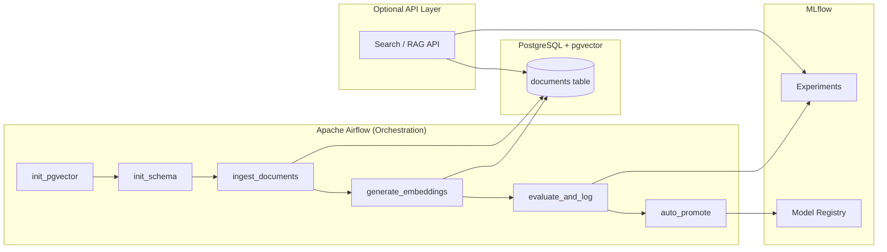

# 🧠 LLM Search Platform — Production-Grade RAG with MLOps

An end-to-end **Retrieval-Augmented Generation (RAG) platform** built with **Airflow, PostgreSQL + pgvector, MLflow, and Docker**, featuring **automated evaluation and metric-driven model promotion**.

This project is intentionally designed as a **production-style Applied AI system**, not a demo. It focuses on orchestration, evaluation, governance, and automation.

---

## 🚀 What This Project Does

- Ingests documents into PostgreSQL  
- Generates embeddings and stores them using **pgvector**  
- Performs semantic retrieval for RAG  
- Evaluates RAG quality using multiple metrics  
- Tracks experiments and artifacts with **MLflow**  
- **Automatically promotes** better models/configurations to Production  
- Orchestrates the entire lifecycle using **Apache Airflow**  
- Runs fully containerized using **Docker Compose**

---

## 🏗️ System Architecture

### High-Level Flow (Mermaid)



**Why Mermaid?**  
- Renders directly on GitHub  
- Keeps architecture close to code  
- Easy to evolve as the system grows  

---

## 🧩 Airflow Pipeline (DAG)

```
init_pgvector
   ↓
init_schema
   ↓
ingest_documents
   ↓
generate_embeddings
   ↓
evaluate_and_log
   ↓
auto_promote
```

### Why this matters
- Prevents race conditions  
- Handles fresh databases and restarts  
- Guarantees pgvector exists before table creation  
- Makes the pipeline self-healing  

---

## 📦 Tech Stack

### Core
- Python 3.8+  
- PostgreSQL 15  
- pgvector  

### MLOps
- MLflow  
  - Experiment Tracking  
  - Artifact Logging  
  - Model Registry  
  - Stage Transitions  

### Orchestration
- Apache Airflow  
  - PythonOperator-based DAG  
  - Retries and dependency control  

### Infrastructure
- Docker  
- Docker Compose  
- Windows-safe local setup  

---

## 🔍 RAG Evaluation Metrics

Each evaluation run logs:

- **avg_retrieval_score** — semantic relevance  
- **avg_generation_score** — answer quality  
- **avg_latency** — end-to-end latency  

All metrics are logged to MLflow and used for promotion decisions.

---

## 🤖 Automated Model Promotion

Promotion is **fully automated** using a transparent policy.

### Promotion Rule

A model is promoted to **Production** if:

- Retrieval score ≥ Production  
- Generation score ≥ Production  
- Latency ≤ Production  

### First-Run Bootstrap

- If no Production model exists  
- First successful evaluation is promoted automatically  
- Registry is initialized safely  

This ensures:
- No manual judgment  
- No silent regressions  
- Fully auditable decisions  

---

## 🔌 API Layer (Why It Exists)

An **API layer** (e.g., FastAPI) is included to **expose the RAG system to external consumers**.

### Responsibilities
- Accepts search / question requests  
- Generates query embeddings  
- Performs vector similarity search via pgvector  
- Assembles context and calls the LLM  
- Returns final answers to clients  

### Why it’s optional here
- The **core learning goal** is MLOps + orchestration  
- API logic is intentionally thin  
- In production, this layer would scale independently  

Including it demonstrates **end-to-end system thinking** without overengineering.

---

## 🗂️ Project Structure

```
.
├── app/
│   ├── ml/
│   │   ├── models.py
│   │   ├── embedding_service.py
│   │   └── auto_promote.py
│   │
│   └── pipelines/
│       ├── init_pgvector.py
│       ├── init_schema.py
│       ├── ingest_documents.py
│       ├── run_evaluation_task.py
│       └── auto_promote_task.py
│
├── scripts/
│   └── generate_embeddings.py
│
├── airflow/
│   └── dags/
│       └── document_pipeline_dag.py
│
├── docker-compose.yaml
├── Dockerfile.airflow
└── README.md
```

---

## 🐳 Running the Project Locally

### Prerequisites
- Docker Desktop  
- Docker Compose  
- Ports available:  
  - 8080 (Airflow)  
  - 5000 (MLflow)  

### Start All Services

```bash
docker compose up
```

### Access UIs
- Airflow UI: http://localhost:8080  
- MLflow UI: http://localhost:5000  

---

## ▶️ Running the Pipeline

1. Open the Airflow UI  
2. Enable the DAG: `document_ingestion_and_embedding`  
3. Trigger the DAG manually  

Expected result:
- All tasks succeed  
- MLflow shows experiment `rag-evaluation`  
- Model `rag_pipeline` promoted to **Production**  

---

## 🧠 Key Design Decisions

### PostgreSQL + pgvector
- Simple and production-ready  
- Avoids unnecessary external vector databases  
- SQL + vectors are debuggable  

### Airflow
- Explicit orchestration and retries  
- Clear dependency management  
- Separation of orchestration and ML logic  

### MLflow
- Strong experiment lineage  
- Built-in model registry  
- Enables automated governance  

---

## 🎯 What This Project Demonstrates

- Applied AI system design  
- MLOps best practices  
- Orchestration-first thinking  
- Metric-driven decisions  
- Production readiness  

---

